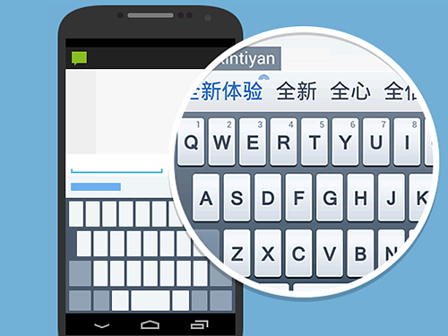
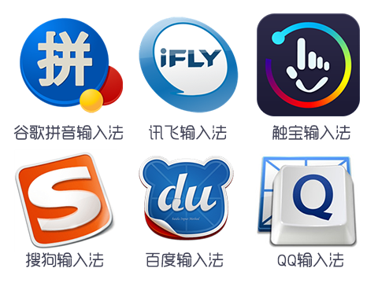
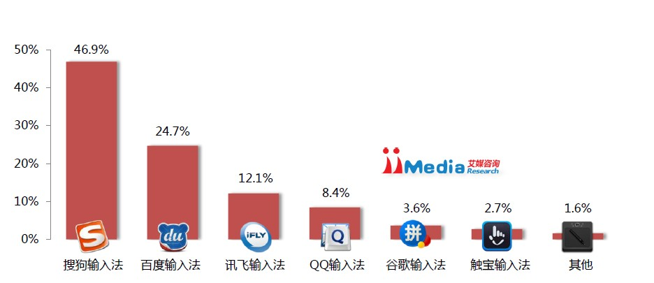
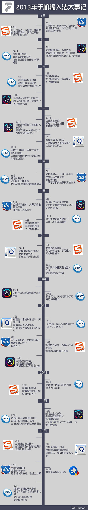
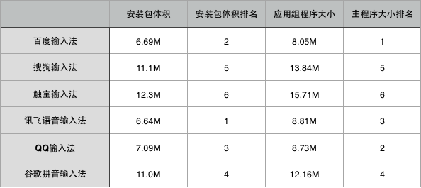

移动端web输入法初探
=================
小幽输入法从构思到实现，承载了众多使命，是对移动端输入法革新的一次初探。如今随着通过一系列的用户体验研究探索，未来的小幽将满足更多用户的需求，2014年将值得大家期待。

关键词：小幽输入法，移动终端，产品定位，用户需求，未来展望

## 市场分析
输入法是手机上最基础，也是使用得最频繁的应用。我们拿到一台手机最先做的事亦是下载喜欢的输入法。这一硬性需求说明了两件事。第一：内置的输入法不好用；第二：输入法在手机的使用需求中占有相当重要的位置。

中国是一个绝对不可忽视的庞大市场，随着意识到输入法作为输入的第一入口的重要性，其潜在的巨大商业价值已经引来各大互联网巨头的激烈竞争，形成了如今百度，触宝，QQ，搜狗，讯飞等百家争鸣的格局。

目前市面上输入法应用多的数不胜数，其中占据大多数移动手机为以下几种：

1. 搜狗拼音输入法
2. 讯飞输入法
3. 百度输入法
4. 腾讯QQ拼音输入法
5. 谷歌拼音输入法
6. 触宝输入法
7. 必应Bing输入法
8. 紫光拼音输入法

在中文输入的领域中， 搜狗输入法，作为PC上占有率最高的输入法，作为老牌的智能输入法，其手机版自然也是最大热门，下载量高居第一显得十分自然。

艾媒咨询发布最新报告《2013Q3中国手机输入法季度监测报告》，报告称，2013Q3中国第三方手机输入法活跃用户占比中，搜狗输入法占比46.9%，相比上季度下降0.2%。百度手机输入法和讯飞输入法分别占比24.7%和12.1%，增长分别为1.2%、0.7%，QQ输入法占比为8.4%。中国第三方手机输入法市场格局已基本形成，市场少有新进竞争者加入，马太效应将开始显现。

## 问题分析
让我们先看一张图：

从图中我们可以看到竞争的激烈，同时也发现因为功能的增加，应用更新的频率也来越快，每隔几天就需要更新一次已是常事。
然而另一方面，升级的过程是缓慢的，大部分用户更新频率较低，甚至不更新，很少能很快的使用到最新的功能，对于频繁的弹出更新消息更会影响用户体验。

接下来看第二张图：

很显然，功能的增加势必会影响到得安装包的大小以及安装后应用所占的空间，显得越来越臃肿。
更不用说需要ios,android两个平台的开发，以及android的碎片化，导致开发成本大，维护难，迭代周期长。

而web2.0时代的到来正是对客户端应用的冲击，html5,css3,javascript的强大，丰富的用户体验，让跨平台的轻应用的大行其道。

## 小幽输入法
小幽输入法是一个什么样的产品？

小幽输入法是一个web端的应用，这样就避免了安装和更新。当你浏览网页，搜索内容，留言评论，都可以使用小幽输入法，阻挡本地输入法的弹出。
然而要使用小幽输入法，必须要服务端的支持，使用方法很简单，仅仅需要在页面中加入一段js代码即可。最重要的是，小幽输入法是开源的，遵循GPL协议，你可以在[这里](http://github.com/urinx/xiaoU_TypeWriting/)fork它。(代码足够乱，不介意请别看)

这里是一个demo预览版，你可以用手机点击该[链接](http://xiaoutype.sinaapp.com)体验。

> 正如那句话所说的，简单可依赖，小幽输入法要做的就是将输入法从本地解放出来。期待将来某一天，手机里不再需要安装输入法，而是由服务方提供。

## 接下来要做的
1. 实现基本的输入方式：九宫格拼音、九宫格英文、笔画输入、手写输入和五笔输入
2. 云输入
3. 挂载词库
4. 手写输入
5. 盲打纠错
6. 语音输入
7. 云计算、大数据的利用

## 最后的话
以上都是某逗比一时无聊所写，权属娱乐。

P.S.当然那个仿ios7的web输入法是真的。。无聊的话大家可以试试。。
